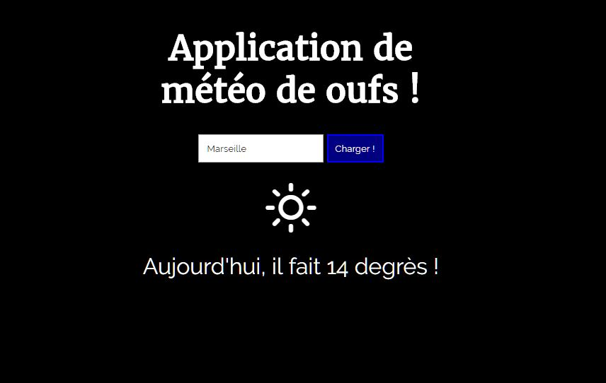

# AJAX - TP de l'après-midi !
Pour ce TP, nous allons construire une petite application web qui va demander à l'utilisateur de quelle ville il veut connaitre la météo actuelle et qui va lui présenter la température et le temps qu'il fait dans la ville qu'il choisit ! Pour cela, l'application se connectera via AJAX au service OpenWeatherAPI !

## Votre attention !
Si vous travaillez sous Cloud9 : faites bien attention à supprimer le "s" de "https://" lorsque vous testez votre code. En effet, cela poserait problème lors de l'appel AJAX qui fonde l'exercice. Donc vous allez sur http://mon-url-de-travail.c9users.io et pas https !
## Structure HTML !
Créez un titre (h1) au sein de l'en-tête (header) : "Application de météo de oufs !". Le reste de la page doit se trouver dans la balise principale (main).

Créez un formulaire (form) dont l'identifiant sera "weather-query" et qui contiendra :

* Un champ texte (input) qui aura l'identifiant "ville" et l'indicateur "Tapez une ville"
* Un bouton (button) pour soumettre le formulaire et qui affichera "Charger !" 

Sous le formulaire, créez une div qui aura l'identifiant "meteo" et qui contiendra :

* Une div avec l'identifiant "temps" et qui contiendra une balise i qui aura par défaut la classe "wi wi-day-rain"
* Une div avec l'identifiant "temperature" et qui contiendra une phrase. Attention, la phrase doit contenir un span avec la classe "degres" qui sera destinée à recevoir la température !

## Design de la page
### Couleurs et disposition

Tout le contenu doit être centré et la couleur de fond doit être "black". La couleur de toutes les typographies doit être "white". Le bouton "Charger !" doit avoir la couleur de fond "navy" et sa bordure doit faire 2px de large et être de couleur "blue".

### Typographies 

Tous les éléments de la page doivent avoir la typographie Google "Raleway" sauf le h1 qui doit avoir la typographie "Merriweather". Vous devrez donc intégrer ces typographies à partir du service Google Fonts.

### Icones météo

Vous utiliserez la librairie CSS "weather-icons" d'Erik Flowers (vive l'open source !) en ajoutant à votre page tout simplement le lien suivant : https://cdnjs.cloudflare.com/ajax/libs/weather-icons/2.0.9/css/weather-icons.min.css

## Partie fonctionnelle (Javascript et Ajax avec jQuery)
### Gestion du formulaire

Créez un comportement qui pourra gérer l'événement "submit" du formulaire. Vous devrez vérifier que le champ "ville" contient bien du texte avant de continuer. Si le champ est vide, faites en sorte que sa bordure devienne rouge afin que l'utilisateur comprenne qu'il y a un soucis.

Si le champ contient bien quelque chose, vous devez appeler l'adresse suivante : http://api.openweathermap.org/data/2.5/weather?q=ville&appid=8e602b9ea28ed4f9f8fc97a5f6d1105c&units=metric en prenant soin de remplacer "ville" dans l'adresse par la ville choisie par la personne !

L'API OpenWeatherMap répond avec des données au format JSON, on utilisera donc la fonction $.getJSON de jQuery.

### Gestion du retour de l'API OpenWeatherMap

Une fois que l'API vous aura répondu, vous devrez gérer sa réponse ! Il faudra extraire de sa réponse :

* La température actuelle dans la ville choisie : cette donnée se trouve dans la propriété `main.temp` de l'objet renvoyé par l'API
* Le temps qu'il fait dans la ville choisie : cette donnée se trouve dans la propriété `weather[0].main` de l'objet renvoyé par l'API

Attention, vous devrez gérer le temps renvoyé par l'API (valeur qui se trouve dans `weather[0].main` de l'objet renvoyé par l'API) afin de faire apparaitre l'icone qui correspond ! La valeur du temps peut prendre 4 valeurs en particulier :

* Rain : le temps est pluvieux, on choisira donc l'icone "wi wi-day-rain"
* Clouds : le temps est nuageux, on choisira donc l'icone "wi wi-day-cloudy"
* Clear : le ciel est clair, on choisira donc l'icone "wi wi-day-sunny"
* Snow : il neige, on choisira donc l'icone "wi wi-day-snow"
* mist : brouillard, on choisira donc l'icone "wi wi-day-fog"
* Drizzle : petite pluie, on choisira donc l'icone "wi wi-day-sleet"

# Derniers conseils
* En utilisant bien jQuery et les sélecteurs CSS, vous ne devez avoir aucun soucis pour sélectionner n'importe quel élément intéressant afin d'en modifier le contenu ou la classe css.
* Aussi, ce code devrait théoriquement tenir en 2 fonctions : une qui gère le submit du formulaire et une autre qui gère le retour de l'API.
 
# Pour en savoir plus sur les outils utilisés 
* Vous pouvez vous rendre sur le site officiel de OpenWeatherMap pour en connaitre plus sur cette super API qui gère la météo : http://openweathermap.org/api
* N'hésitez pas aussi à vous rendre sur la documentation de la librairie CSS "weather-icons" ici : https://erikflowers.github.io/weather-icons/

### Screenshot avant utilisation

### Screenshot après utilisation

